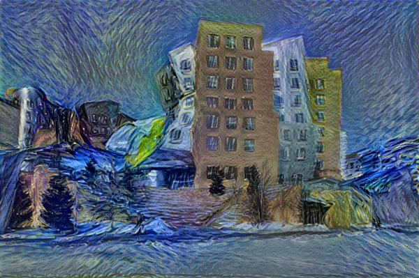

## DEEP LEARNING 실습 과제 제출용 

# neural-style

An implementation of [neural style][paper] in TensorFlow.

This implementation is a lot simpler than a lot of the other ones out there,
thanks to TensorFlow's really nice API and [automatic differentiation][ad].

TensorFlow doesn't support [L-BFGS][l-bfgs] (which is what the original authors
used), so we use [Adam][adam]. This may require a little bit more
hyperparameter tuning to get nice results.

**See [here][lengstrom-fast-style-transfer] for an implementation of [fast
(feed-forward) neural style][fast-neural-style] in TensorFlow.**

## Running

 python neural_style.py --content n.jpg --styles s.jpg --output o.jpg

## Example 1

Running it for 500-2000 iterations seems to produce nice results. With certain
images or output sizes, you might need some hyperparameter tuning (especially
`--content-weight`, `--style-weight`, and `--learning-rate`).

The following example was run for 1000 iterations to produce the result (with
default parameters):



These were the input images used (me sleeping at a hackathon and Starry Night):


## Requirements

### Data Files

* [Pre-trained VGG network][net] (MD5 `8ee3263992981a1d26e73b3ca028a123`) - put it in the top level of this repository, or specify its location using the `--network` option.

### Dependencies

You can install Python dependencies using `pip install -r requirements.txt`,
and it should just work. If you want to install the packages manually, here's a
list:

* [TensorFlow](https://www.tensorflow.org/versions/master/get_started/os_setup.html#download-and-setup)
* [NumPy](https://github.com/numpy/numpy/blob/master/INSTALL.rst.txt)
* [SciPy](https://github.com/scipy/scipy/blob/master/INSTALL.rst.txt)
* [Pillow](http://pillow.readthedocs.io/en/3.3.x/installation.html#installation)

## Citation

If you use this implementation in your work, please cite the following:

```
@misc{athalye2015neuralstyle,
  author = {Anish Athalye},
  title = {Neural Style},
  year = {2015},
  howpublished = {\url{https://github.com/anishathalye/neural-style}},
  note = {commit xxxxxxx}
}
```

## License

Copyright (c) 2015-2017 Anish Athalye. Released under GPLv3. See
[LICENSE.txt][license] for details.

[net]: http://www.vlfeat.org/matconvnet/models/beta16/imagenet-vgg-verydeep-19.mat
[paper]: http://arxiv.org/pdf/1508.06576v2.pdf
[l-bfgs]: https://en.wikipedia.org/wiki/Limited-memory_BFGS
[adam]: http://arxiv.org/abs/1412.6980
[ad]: https://en.wikipedia.org/wiki/Automatic_differentiation
[lengstrom-fast-style-transfer]: https://github.com/lengstrom/fast-style-transfer
[fast-neural-style]: https://arxiv.org/pdf/1603.08155v1.pdf
[license]: LICENSE.txt
